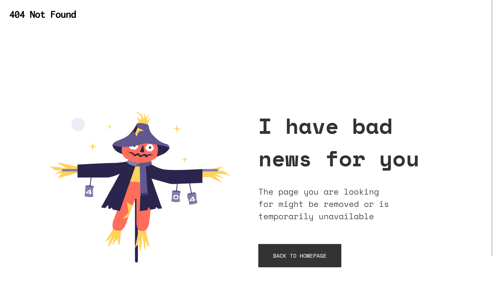
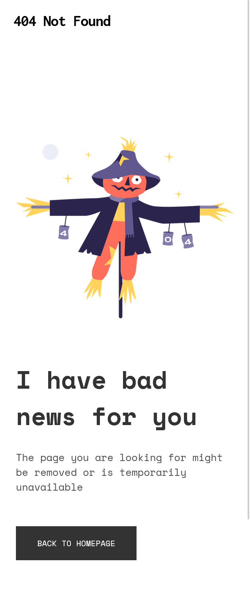

<!-- Please update value in the {}  -->

<h1 align="center">404 Not Found Page</h1>

   Solution for a challenge from  <a href="http://devchallenges.io" target="_blank">Devchallenges.io</a>.

  <h3>
    <a href="https://{your-demo-link.your-domain}">
      Demo
    </a>
     | 
    <a href="https://{your-url-to-the-solution}">
      Solution
    </a>
     | 
    <a href="https://legacy.devchallenges.io/challenges/wBunSb7FPrIepJZAg0sY">
      Challenge
    </a>
  </h3>

<!-- TABLE OF CONTENTS -->

## Table of Contents

- [Overview](#overview)
  - [Built With](#built-with)
- [Features](#features)
- [Contact](#contact)

<!-- OVERVIEW -->

## Overview

- Desktop View

- Mobile View
  

This is a beginner level challenge to experiment around for responsive developers or who are aspiring to add responsive design in there skillsets.

This was an amazing experience for me in implementing this type of design layout. While implementing a responsive design, we have to take into account the font styles, typography, color contrasts are some accessibility criterias to name a few to be taken into account while creating a site.

I have been trying to learn to implement semantic html to implement accessbile websites while making it responsive as well.

What all challenges you are trying to face, consistency is the key achieving the target that you desire for.

### Built With

- HTML
- CSS

## Features

This application/site was created as a submission to a [DevChallenges](https://devchallenges.io/challenges) challenge. The [challenge](https://legacy.devchallenges.io/challenges/wBunSb7FPrIepJZAg0sY) was to build a responsive 404 Not Found Page according to the Figma Design.

## Contact

- GitHub [@sreehariv-code](https://github.com/sreehariv-code)
- Twitter [@sreehariv07](https://twitter.com/sreehariv07)
